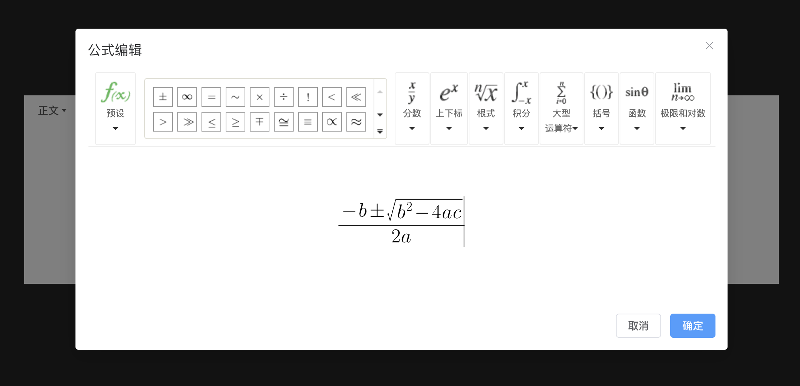
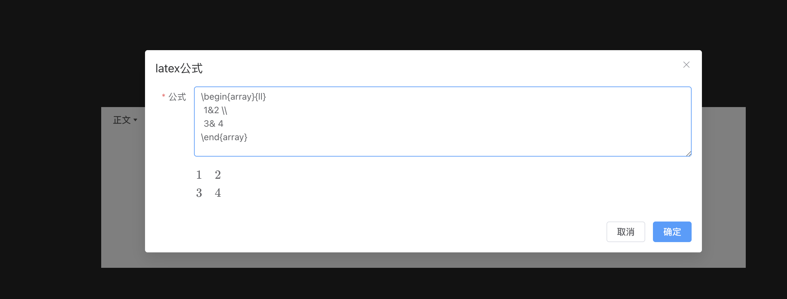

# wangeditor-next-for-LaTeX


基于 [wangeditor-next](https://github.com/wangeditor-next/wangeditor-next) 的富文本编辑器，扩展支持 LaTeX 公式编辑与渲染。

**在线演示：[https://sh-space.github.io/wangeditor-next-LaTeX/](https://sh-space.github.io/wangeditor-next-LaTeX/)**

## 演示截图

**编辑器界面**



**公式编辑**



## 功能特性

- **富文本编辑** — 基于 wangeditor-next，支持标题、加粗、表格、图片上传等常用功能
- **可视化公式编辑** — 集成 KityFormula 可视化公式编辑器，所见即所得
- **LaTeX 公式输入** — 支持直接输入 LaTeX 语法插入公式
- **公式渲染** — 通过 MathJax 渲染 LaTeX 公式，支持预览模式
- **禁用模式** — 支持只读模式，可配置是否显示工具栏

## 技术栈

- Vue 3 + TypeScript + Vite
- [@wangeditor-next/editor](https://github.com/wangeditor-next/wangeditor-next) v5.6+
- MathJax / KaTeX 公式渲染
- Element Plus UI 组件库
- markdown-it 内容解析

## 项目结构

```
src/
├── components/WangEditorNext/
│   ├── index.vue                    # 编辑器主组件
│   └── components/
│       ├── formula-dialog.vue       # KityFormula 可视化公式弹窗
│       ├── latex-dialog.vue         # LaTeX 公式输入弹窗
│       └── doc-item-preview.vue     # 内容预览组件（含公式渲染）
└── utils/
    ├── plugin.ts                    # 自定义菜单注册（MyKityFormula、LaTeX 等）
    └── mathjax.ts                   # MathJax 配置
```

## 快速开始

```bash
# 安装依赖
npm install

# 启动开发服务器
npm run dev

# 构建
npm run build
```

## 使用方式

```vue
<WangEditorNext
  v-model:value="content"
  :disabled="false"
  placeholder="请输入内容..."
  containerHeight="500px"
/>
```

### Props

| 参数 | 说明 | 类型 | 默认值 |
|------|------|------|--------|
| value | 编辑器内容（HTML） | `string` | `''` |
| disabled | 是否禁用编辑 | `boolean` | `false` |
| disabledShowToolbar | 禁用状态下是否显示工具栏 | `boolean` | `true` |
| placeholder | 占位文本 | `string` | `'请输入内容...'` |
| mode | 编辑器模式 | `'default' \| 'simple'` | `'simple'` |
| containerHeight | 容器高度 | `string` | `'300px'` |

### Events

| 事件 | 说明 |
|------|------|
| `update:getHtml` | 编辑器 HTML 内容变化 |
| `update:getText` | 编辑器纯文本内容变化 |
| `blurFinished` | 编辑器失焦完成 |
| `update:content` | 失焦时输出最终内容 |
